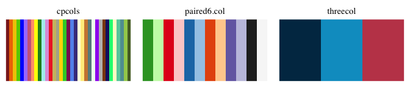
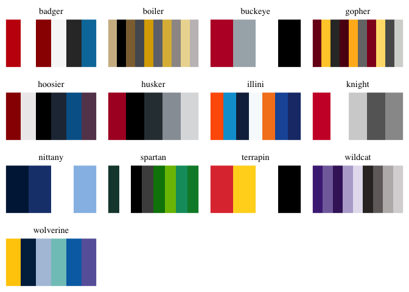

# guzioR <a href='https://guziordo.github.io/guzioR/'></a>

<!-- badges: start -->

[](https://creativecommons.org/publicdomain/zero/1.0/?ref=chooser-v1)
[](https://github.com/guziordo/guzioR/actions/workflows/test-coverage.yaml)
[](https://github.com/guziordo/guzioR/actions/workflows/R-CMD-check.yml)
<!-- badges: end -->

A compilation of various commands and tools I’ve used that may be
helpful. This package will not be routinely updated, but I’ll add things
as they come up.

## Installation

Install the development version from [GitHub](github.com) using the
following:

``` r
# install.packages("devtools")
devtools::install_github("guziordo/guzioR")
```

## Usage

``` r
library(guzioR)
```

## Included Palettes

These are compilations of palettes provided by friends or otherwise
generated for fun.



<i>Thank you to [Dr. Lydia-Ann
Ghuneim](https://www.linkedin.com/in/lydia-ann-ghuneim/) for providing
the CPCOLS palette.</i>

### Big 10 Palettes

I don’t own any of the rights to things from the Big 10. These are some
palettes generated based on their brand identities. First two colors in
each are the primary colors of that school.



### Selecting Palettes

Each can be subset based on what groups are wanted. Thanks to [Michael
McCarthy](https://github.com/mccarthy-m-g) for the original text
description, which has been modified below.

- For a single palette:

``` r
b10.pal$buckeye
#> <palettes_colour[4]>
#> • #BA0C2F
#> • #A7B1B7
#> • #FFFFFF
#> • #000000
```

- For a multiple palettes:

``` r
b10.pal[c("buckeye","spartan")]
#> <palettes_palette[2]>
#> $buckeye
#> <palettes_colour[4]>
#> • #BA0C2F
#> • #A7B1B7
#> • #FFFFFF
#> • #000000
#> 
#> $spartan
#> <palettes_colour[8]>
#> • #18453B
#> • #FFFFFF
#> • #000000
#> • #4D4D4D
#> • #008208
#> • #7BBD00
#> • #0B9A6D
#> • #008934
```
