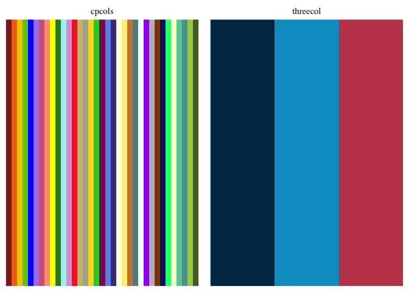

# guzioR

A compilation of various commands and tools I’ve used that may be
helpful. This package will not be routinely updated or maintained, but
I’ll add things as they come up.

## Installation

Install the development version from [GitHub](github.com) using the
following:

    remotes::install_github("guziordo/guzioR")

## Usage

    library(guzioR)

## Included Functions

<b>quick.boxplot</b>   Just as is sounds, it’s a quick and easy way
to generate a box plot with points and statistics (if wanted).

## Included Palettes

These are compilations of palettes provided by friends or otherwise
generated for fun.

<i>Thank you Lydia-Ann Ghuneim, Ph.D. for providing the CPCOLS
palette.</i>

### Big 10 Palettes

I don’t own any of the rights to things from the Big 10. These are some
palettes generated based on their brand identities. First two colors in
each are the primary colors of that school.

