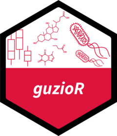

# guzioR <a href='https://guziordo.github.io/guzioR/'></a>

<!-- badges: start -->

[](https://github.com/guziordo/guzioR/actions/workflows/pkgdown.yaml)
[](https://github.com/guziordo/guzioR/actions/workflows/test-coverage.yaml)
[](https://github.com/guziordo/guzioR/actions/workflows/R-CMD-check.yml)
<!-- badges: end -->

A compilation of various commands and tools I’ve used that may be
helpful. This package will not be routinely updated, but I’ll add things
as they come up.

## Installation

Install the development version from [GitHub](github.com) using the
following:

``` r
# install.packages("devtools")
devtools::install_github("guziordo/guzioR")
```

## Usage

``` r
library(guzioR)
```

## Included Palettes

There are 3 palettes included, built by myself or others.


<i>Thank you to [Dr. Lydia-Ann
Ghuneim](https://www.linkedin.com/in/lydia-ann-ghuneim/) for providing
the CPCOLS palette.</i>

### Big 10 Palettes

I don’t own any of the rights to things from the Big 10. These are some
palettes generated based on their brand identities. First two colors in
each are the primary colors of that school.


## Selecting Palettes

Each can be subset based on what groups are wanted, either with
`$<name>` for single palettes within a set or using the method below to
select multiple.

``` r
b10.pal[c("buckeye","spartan")]
```


